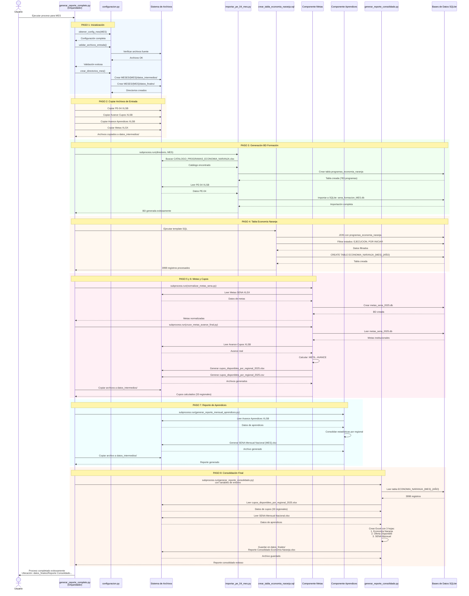
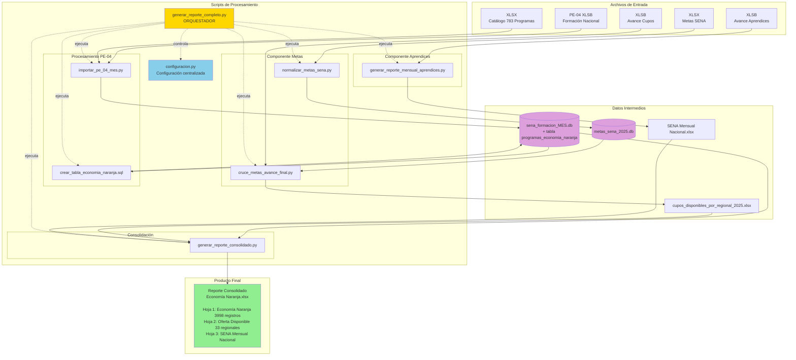
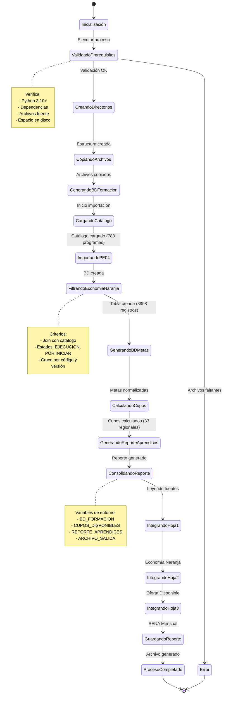

# Diagramas del Proceso Automatizado de Reporte de Economía Naranja

## Diagrama de Flujo del Proceso Completo

```mermaid
flowchart TD
    Start([Inicio: generar_reporte_completo.py]) --> Validate{Verificar<br/>prerequisitos}

    Validate -->|Error| EndError([Fin: Error de validación])
    Validate -->|OK| Step1[Paso 1: Crear estructura<br/>de directorios]

    Step1 --> Step2[Paso 2: Copiar archivos<br/>de entrada a datos_intermedios]

    Step2 --> Step3[Paso 3: Generar BD de formación<br/>importar_pe_04_mes.py]
    Step3 --> Step3a[Cargar catálogo de<br/>programas economía naranja]
    Step3a --> Step3b[Convertir PE-04 XLSB<br/>a SQLite]

    Step3b --> Step4[Paso 4: Crear tabla<br/>economía naranja]
    Step4 --> Step4a[Ejecutar SQL template:<br/>crear_tabla_economia_naranja.sql]
    Step4a --> Step4b[Filtrar 783 programas<br/>de economía creativa]

    Step4b --> Step5[Paso 5: Generar BD de metas<br/>normalizar_metas_sena.py]
    Step5 --> Step5a[Normalizar metas<br/>institucionales]

    Step5a --> Step6[Paso 6: Calcular cupos<br/>disponibles]
    Step6 --> Step6a[cruce_metas_avance_final.py:<br/>META - AVANCE]
    Step6a --> Step6b[Generar XLSX y CSV de<br/>cupos disponibles]
    Step6b --> Step6c[Copiar archivos a<br/>datos_intermedios]

    Step6c --> Step7[Paso 7: Generar reporte<br/>de aprendices]
    Step7 --> Step7a[generar_reporte_mensual_aprendices.py:<br/>Consolidar estadísticas]
    Step7a --> Step7b[Copiar reporte a<br/>datos_intermedios]

    Step7b --> Step8[Paso 8: Consolidación final]
    Step8 --> Step8a[generar_reporte_consolidado.py:<br/>Integrar 3 fuentes]
    Step8a --> Step8b{Validar<br/>archivos generados}

    Step8b -->|Error| EndError2([Fin: Error en generación])
    Step8b -->|OK| Step8c[Generar Excel con 3 hojas:<br/>1. Economía Naranja<br/>2. Oferta por Regional<br/>3. SENA Mensual]

    Step8c --> Step8d[Guardar reporte en<br/>datos_finales/]

    Step8d --> Success{Proceso<br/>exitoso?}
    Success -->|Si| EndSuccess([Fin: Reporte generado exitosamente])
    Success -->|No| EndError3([Fin: Error en proceso])

    style Start fill:#90EE90
    style EndSuccess fill:#90EE90
    style EndError fill:#FFB6C1
    style EndError2 fill:#FFB6C1
    style EndError3 fill:#FFB6C1
    style Step8c fill:#87CEEB
```

## Diagrama de Secuencia del Sistema

## Diagrama de Arquitectura de Componentes

## Diagrama de Estados del Proceso

## Descripción de los Diagramas

### 1. Diagrama de Flujo del Proceso Completo
Muestra el flujo secuencial de los 8 pasos del proceso automatizado, incluyendo:
- Validaciones y puntos de decisión
- Generación de archivos intermedios
- Procesamiento de cada componente
- Consolidación final del reporte

### 2. Diagrama de Secuencia del Sistema
Ilustra la interacción temporal entre componentes:
- Orquestador (`generar_reporte_completo.py`) como coordinador central
- Llamadas entre scripts mediante `subprocess`
- Lectura/escritura de archivos y bases de datos
- Flujo de datos entre componentes
- Generación del reporte consolidado con 3 hojas

### 3. Diagrama de Arquitectura de Componentes
Presenta la estructura modular del sistema:
- Archivos de entrada (fuentes institucionales)
- Scripts de procesamiento organizados por función
- Bases de datos SQLite como almacenamiento intermedio
- Producto final consolidado
- Relaciones de dependencia entre componentes

### 4. Diagrama de Estados del Proceso
Describe los estados del sistema durante la ejecución:
- Transiciones entre estados
- Puntos de validación
- Notas con información clave de cada estado
- Manejo de errores y flujos alternativos

## Notas Técnicas

### Tecnologías Utilizadas en los Diagramas
- **Sintaxis**: Mermaid (compatible con GitHub, GitLab, y muchos visualizadores MD)
- **Renderización**: Los diagramas se renderizan automáticamente en plataformas compatibles

### Visualización
Para visualizar estos diagramas:
1. **GitHub/GitLab**: Automático al ver el archivo MD
2. **VS Code**: Instalar extensión "Markdown Preview Mermaid Support"
3. **Online**: https://mermaid.live/ (copiar y pegar el código)

### Colores en los Diagramas
- **Verde** (#90EE90): Estados exitosos
- **Rojo** (#FFB6C1): Estados de error
- **Azul claro** (#87CEEB): Procesos de consolidación
- **Amarillo** (#FFD700): Componente orquestador
- **Púrpura** (#DDA0DD): Bases de datos

---
